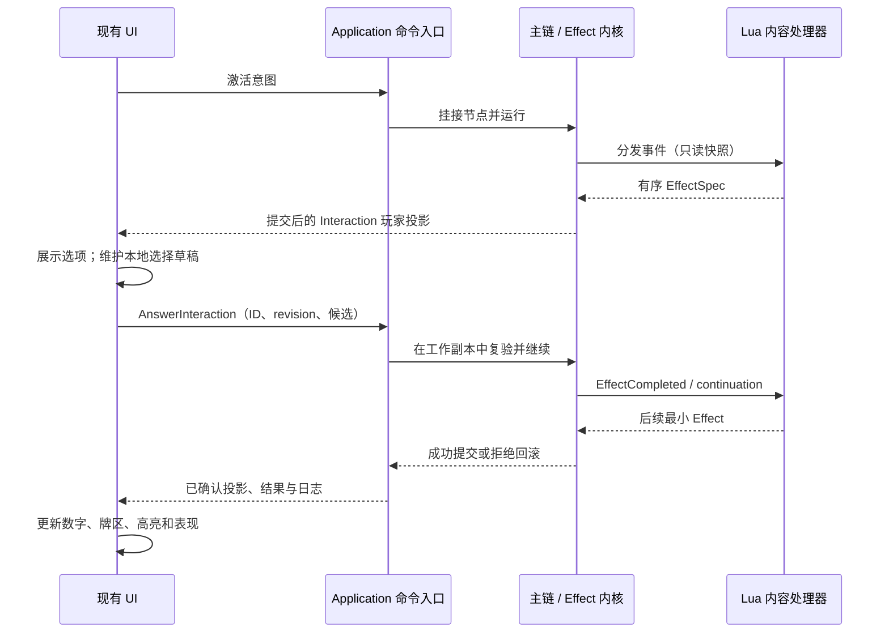

# 2D Unity 模拟器总体架构

本文维护当前架构落点、技术选型和仍需扩展的边界。完整玩法状态见 `docs/概览/项目总览.md`，模块级实现见 `docs/架构/程序模块设计.md`，联机细节见 `docs/模块文档/多人房间与联机入口方案.md`。

## 1. 分层与依赖方向

```text
Presentation / Unity UI
  -> Application / GameSession / Command Handlers
    -> Domain / State / Rules / Effects / Scoring

Infrastructure / Lua / Multiplayer -> Domain 与 Application 提供的合同
Composition root -> 组装 Application、Domain 与 Infrastructure
Data -> Domain definition loaders and Presentation resources
Tests -> Domain / Application / Infrastructure / Presentation workflows
```

工程映射：

```text
Domain         -> Assets/YC/Domain
Application    -> Assets/YC/Application
Presentation   -> Assets/YC/Presentation
Infrastructure -> Assets/YC/Infrastructure
Data           -> Assets/YC/Data、Assets/StreamingAssets/YC/Data
Tests          -> Assets/YC/Tests/EditMode
```

## 2. 当前已落地架构

- `GameState`、`PlayerState`、阶段状态、待选状态和最终计分状态均由规则层持有，可序列化并进入 Host 快照。
- 所有玩家操作通过 `GameSession.Submit(GameCommand)` 和命令处理器校验、结算；Presentation 只查询合法选项并提交命令。
- 四人地图、路径、路费、影响力、事件抽取、移动城市、建设、采集、收尾、区控和最终计分已形成基础闭环。
- 41 张普通设施卡由运行时 manifest 提供逐卡元数据；设施即时效果和强制待选分别由领域服务与独立表现层工作流承载。
- 角色牌的生产激活已接入主链 Effect；内核交互使用 `InteractionRequest`。雷蛇策略/收尾、极境策略、坎诺特计谋与入场奖励已采用 Lua 通用 Effect 组合；其他部分卡面仍通过 C# 专用执行器，旧 `PendingCharacterEffectState` 和延迟列表仅属待清理的兼容路径，不能作为新功能的设计依据。
- `YC.Presentation.Workflows` 承载无 Unity 引擎依赖的 Presenter；主交互控制器只保留生命周期、依赖组装、输入转发和统一刷新。
- 表现层地图输入统一进入 `InteractionRouter`。交互通过 `IInteraction` 声明 `Id`、优先级、活跃状态、四类输入、展示快照、取消和命令结算通知；路由按“待选结算 > 进行中动作 > 默认地图路由”稳定分派，首个 `Consumed` 或 `RejectedWithPrompt` 终止责任链。
- `InteractionMode` 只保留 `Hidden / ChooseAction / Busy / WaitingForNextPlayer` 四种面板态。移动、探索、部署、调度、建设等细步骤由各交互的局部 stage 或 `BuildFacilityDraftPhase` 持有，地图路由依据 `ActiveWorkflow` 身份和局部阶段分派，不再从全局细枚举猜测动作。
- `CommandGateway` 统一处理命令无结果、同步拒绝、已发往 Host、本地应用四种结果；`LocalPlayerResolver` 集中处理热座当前玩家和采集顺序切换。
- 标准建设由独立 `BuildInteraction` 持有本地草稿，ViewModel 只暴露一个封闭的 `BuildFacilityIntent` 分派入口。Esc 将聚焦/确认态缩回本地虚影，只有明确取消意图才清除草稿。
- 五类主要行动交互分别由 `BuildInteraction`、`DeployInteraction`、`DispatchInteraction`、`MoveInteraction`、`ExploreInteraction` 持有；部署已改为先挂 `action.main.execute` 再由内核创建选点，确认前可取消；调度仍复用 `InfluenceActionPresenter` 的流程逻辑，探索复用 `ExplorationEventPresenter`，但两个 Presenter 均不再作为 `IInteraction` 直接注册。城市样式预览与行动面板策略分别由 `CityStyleInteraction`、`TurnActionPanelPresenter` 持有；`TurnActionPresenter` 仅负责动作分发并受 400 行架构门禁约束。
- `CharacterCardInteraction` 组合角色牌弹窗、设施供应选择与地图选点协调器，特殊行动和设施待选通过适配器进入同一优先级链；`InteractionRouter.NotifyCommandSettled` 广播命令结算，标准建设、设施待选和特殊行动均以命令/会话双键防止等待 Host 时重复提交，销毁时由 `CancelAll` 统一释放已注册交互。
- 行动面板按压、地图目标脉冲和确认落点特效由独立 Unity 反馈组件承载，不进入工作流状态机；高亮只写青色圆环/边框 overlay，地图桌面由相机深石板灰背景提供，不修改地图贴图 tint。
- 联机使用 Steam Lobby + Mirror/FizzySteamworks；Host 校验命令，按每个连接的玩家权限生成 `GameStateView` 后发送投影 DTO，客户端不接收权威完整状态。Host 内部归档/诊断快照与网络 DTO 分离。本地开发模式使用 Mirror/Telepathy 和 Host 签发的信令身份凭据。
- 等待房间将席位就绪拆为 Lobby 成员存在、传输已连接、身份已验证、初始状态已同步四个阶段；开局门禁只信任 Host 权威数据。

## 3. 关键约束

- `Domain` 不依赖 `UnityEngine`、场景对象或 Presentation。
- UI、联网 Client、自动跑局都不能绕过命令校验直接写 `GameState`。
- 地图热点坐标、图片和卡面文本不作为规则事实源；规则使用稳定 id 与结构化数据。
- 强制待选必须先证明至少存在一个合法完成路径；创建后必须显式结算，不能静默跳过。
- 联机身份以 Host 观察到的连接和稳定席位映射为准，Client 不能声明自己或其他玩家已经就绪。
- 新增规则至少覆盖成功、失败和失败不写回；涉及异步连接时还要覆盖断线、重连和迟到回调。

## 4. 当前架构缺口

- 三人地图仍是 placeholder，尚未形成与四人地图同等级的真实规则数据。
- 城市样式已支持 0°/90°/180°/270° 旋转匹配且不允许镜像；五种对应特殊行动的 Host 权威完整效果、待处理会话与自动化交互链路均已接通，剩余为人工 UI 与多进程/真实 Steam 交付验收。
- `InteractionPresentation` 已建立数据契约，但部分旧待选协调器的展示仍由 `Synchronize()` 副作用完成；后续应继续把提示和高亮收口为纯展示快照。
- 建设已切换到单 Intent 通道，探索路径、事件选择等旧 ViewModel 仍有专用回调，尚未全部迁移为统一 Intent。
- Host 归档/恢复、命令日志和按连接裁剪的网络投影已有实现及自动化测试；玩家可操作的完整存档/回放界面与多进程实测仍需补齐。
- 企业扩展、AI、专用服务器、房主迁移不在当前实现范围。
- Steam 联机仍缺多账号真实 P2P/Relay、网络抖动和强退等人工端到端验收。

## 5. 技术选型、待决策与风险

当前技术基线：

- Unity：项目版本以 `ProjectSettings/ProjectVersion.txt` 为准；本轮验证使用 `2022.3.62f1c1`。
- UI：UGUI。
- 测试：Unity Test Framework / EditMode。
- 规则核心：纯 C#，通过 asmdef 与 Unity 表现层隔离。
- 玩家操作：Command Pattern。
- 流程：持久化回合主链和 Effect 树；兼容 Phase/CurrentPlayer 字段由主链投影。

仍需决策：

- 规则数据最终采用 JSON、ScriptableObject 还是混合方案。
- 三人地图热点和航道槽位坐标的编辑方式。
- 存档、回放和日志的序列化格式。
- Debug UI 与正式 UI 是否继续共用场景。

主要风险：

- 规则书与卡面文字需要人工校对，不能完全依赖 OCR。
- 地图是图结构，表现坐标必须与规则连接数据分别维护。
- 路径费用包含玩家选择权，不能简单退化成单一路径最短路。
- 卡牌效果若绕过统一效果契约硬编码，会提高企业扩展的维护成本。

## 6. Effect 与 UI 的职责边界（2026-09-20）



- `InteractionRequestRouter` 负责权限投影和 renderer 选择。Controller 不能再维护第二份类型白名单。
- `EffectInteractionCommands` 是事件、角色、地图、设施和特殊行动新请求共用的回答协议。每次新意图使用唯一命令 ID，保留玩家看到的 revision；Host 决定答案是否有效。
- renderer 不写资源、位置、牌区或主链。单选直接提交；多选仅在确认后提交；数量分配继续复用现有弹窗。动画结束不是推进规则的条件。
- 角色十个入口统一先激活，去掉旧资源/地图/设施预选；既有 `Pending*` adapter 仍有真实调用方，不能据此宣称全部 UI 已完成迁移。
- Lua 内容版本/hash 与通用执行器版本独立。Choice 完成事件的执行器版本不得覆盖 continuation 的内容版本。新增资源组合内容为 `1.2.0`；缺失或不匹配的绑定仍暂停故障，不重新执行奖励。
- 新代码只能沿上面的入口扩展。旧 `RoundAdvanceService` 和内容专用 C# 执行器的移除条件见 `docs/设计/Lua新架构迁移结案.md`。

### 交互接线补充（2026-09-20）

设施新请求由 `FacilityInteractionUiCoordinator` 读取权限投影，特殊行动保留专用地图适配入口；二者都使用 `EffectInteractionCommands` 回答工厂。设施多目标选择只维护本地草稿，不能自动替玩家补齐目标。资源分配也是待校验意图，确认提交前不改玩家资源。当前统一的是请求/回答/结算合同，专用同步入口与旧 Pending adapter 尚未全部并入能力 Router；不能把此阶段标成旧交互彻底移除。


## 2026-09-20：条件式与交互提交边界

角色和城市样式的条件费用必须先进入 Effect 链：激活 → Condition 左式（可能等待材料组合/放弃选择）→ 支付提交 → Condition 右式（逐步创建目标交互、执行并展示变化）。右式候选不能在左式完成前生成，UI 只回答请求，不持有待扣费用或跨步骤修改状态。

极境计谋使用通用 MoveCity，额外约束相邻、已探索、有己方影响力；没有单独突袭结算。德克萨斯计谋每次移除/移动都是基础子 Effect，实际提交后再生成下一步，按 InfluenceId 排除已移动实例。锡人的两个可选条件分别执行，普通失败不回滚其无条件得分和后续兄弟节点。

复合动力通过 `effect.resource.pay.choice` 在条件左侧复用原材料分配弹窗；一次校验并支付整个组合，右侧才创建 MoveCity。移动及事件完成后，版本化 Lua continuation 生成限定航道候选的 PlaceInfluence。高效移动两段复用实时目标查询。支付前取消不消耗特殊行动标记/预算，支付成功后右式普通失败不退款。

本轮未移除仍有调用方的旧 Pending API；完整迁移状态见《Lua新架构迁移结案》，不得把通用节点已接入等同于全部内容已迁完。
