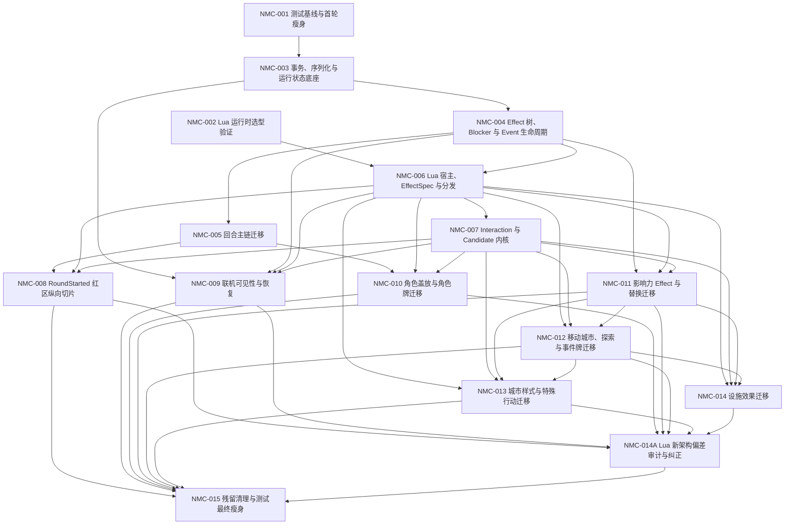

# 新架构实施提示词索引

本文档把 Lua Effect 树与回合主链改造拆分为可独立验收的实施任务。每个任务都对应一份可直接交给 Codex 执行的提示词；执行任务时必须同时遵守[共同执行约束](00-共同执行约束.md)。

## 当前基线

- 项目：`G:\NoMadCity`
- Unity：`D:\2022.3.62f1c1\Editor\Unity.exe`，已确认文件存在，产品版本为 `2022.3.62f1c1`。
- EditMode：当前有 107 个 C# 测试文件；静态计数为 930 个 `[Test]` 与 99 个 `[TestCase/TestCaseSource]` 声明。准确发现用例数由 `NMC-001` 使用 Unity Test Runner 建立。
- 测试体量主要集中在交互/表现、Domain 规则、EditorAsset 合同、Command/Application 和网络五类。
- `docs/设计/命令与效果系统准备规范.md` 已废弃。发生冲突时，以 `docs/设计/Lua效果树与回合主链设计.md` 和 `docs/设计/Lua效果系统API初稿.md` 为准。
- 当前工作区可能包含用户尚未提交的文档、图片、Sprite 或其他改动；所有任务都必须保留与本任务无关的改动。

## 目标顺序

`NMC-001` 与 `NMC-002` 可以并行。`NMC-005` 与 `NMC-006` 在 `NMC-004` 完成后也可并行。内容迁移任务应尽量按编号顺序进行；如果并行，必须避免同时修改 `GameState`、`GameSession`、通用交互路由和同一测试基类。

## 任务目录

| 编号 | 提示词 | 主要产出 | 前置任务 |
| --- | --- | --- | --- |
| NMC-001 | [测试基线与首轮瘦身](NMC-001-测试基线与首轮瘦身.md) | 精确测试清单、测试组合并、共享 fixture、首轮数量下降 | 无 |
| NMC-002 | [Lua 运行时选型验证](NMC-002-Lua运行时选型验证.md) | ADR、最小运行验证、沙箱和 AOT 结论 | 无 |
| NMC-003 | [事务、序列化与运行状态底座](NMC-003-事务序列化与运行状态底座.md) | `EffectRuntimeState`、DTO、稳定 ID、工作副本事务 | NMC-001 |
| NMC-004 | [Effect 树、Blocker 与 Event 生命周期](NMC-004-Effect树与Event生命周期.md) | 树执行器、状态机、阻塞、完成响应窗口、fail-stop | NMC-003 |
| NMC-005 | [回合主链迁移](NMC-005-回合主链迁移.md) | `3P+4` 主链、第一回合入口、兼容投影 | NMC-004 |
| NMC-006 | [Lua 宿主、EffectSpec 与分发](NMC-006-Lua宿主与EffectSpec分发.md) | Lua Host、API 门面、编译器、订阅、continuation | NMC-002、003、004 |
| NMC-007 | [Interaction 与 Candidate 内核](NMC-007-Interaction与Candidate内核.md) | 通用交互、候选池、补丁、回答复验 | NMC-004、006 |
| NMC-008 | [RoundStarted 红区纵向切片](NMC-008-RoundStarted红区纵向切片.md) | 首个端到端 Lua Effect、红区开放、空响应直通 | NMC-005、006、007 |
| NMC-009 | [联机可见性与恢复](NMC-009-联机可见性与恢复.md) | 玩家视图、日志隐私、断线恢复、幂等验证 | NMC-003、004、006、007 |
| NMC-010 | [角色盖放与角色牌迁移](NMC-010-角色盖放与角色牌迁移.md) | 统一盖放节点、角色入口、逐步移除角色专用 pending | NMC-005、006、007、009 |
| NMC-011 | [影响力 Effect 与替换迁移](NMC-011-影响力Effect与替换迁移.md) | 放置/移除/移动/替换通用 Effect 与三事件语义 | NMC-004、006、007 |
| NMC-012 | [移动城市、探索与事件牌迁移](NMC-012-移动城市探索与事件牌迁移.md) | `BeforeCityMove`、候选、移动完成响应、事件牌 | NMC-006、007、011 |
| NMC-013 | [城市样式与特殊行动迁移](NMC-013-城市样式与特殊行动迁移.md) | 城市样式 Lua、特殊行动入口、收尾处理器 | NMC-006、007、011、012 |
| NMC-014 | [设施效果迁移](NMC-014-设施效果迁移.md) | 设施入场 Lua、通用交互替换旧设施 pending | NMC-006、007、011、012 |
| NMC-014A | [Lua 新架构偏差审计与纠正](NMC-014A-Lua新架构偏差审计与纠正.md) | 收紧 Lua API、纠正内容所有权、行动挂树、主链自动推进与内核语义 | NMC-008 至 014 |
| NMC-015 | [残留清理与测试最终瘦身](NMC-015-残留清理与测试最终瘦身.md) | 删除旧调用链、压缩测试组合、完整回归与迁移结案 | NMC-014A |

## 测试瘦身总目标

`NMC-001` 先取得 Unity 实际发现数并完成低风险合并；之后每个实现任务都必须同步删除或合并本范围内被新架构替代的重复测试。最终 `NMC-015` 的目标是：

- EditMode 实际发现用例数原则上不超过 700；如确有必要超过，必须用行为覆盖矩阵逐项解释保留原因。
- 不通过 `[Ignore]`、改名、移动到不可发现目录或只删断言来降低数量。
- 每个重要规则只在最低成本层保留一组权威测试，上层只保留少量跨层合同和冒烟测试。
- 新架构测试必须优先使用参数化、场景表和共享 fixture，不能把旧的一千项逐个复制成另一千项。
- 被删除的旧测试必须能指向仍然覆盖同一规则风险的新测试或数据驱动用例。

## 使用方式

执行某项任务时，把对应 `NMC-xxx` 文档作为主提示词，并要求执行者先完整阅读 `prompt/00-共同执行约束.md` 以及提示词列出的源文档。不要跳过前置任务的验收记录；若前置任务实际尚未完成，应停止实现并报告依赖缺口。
