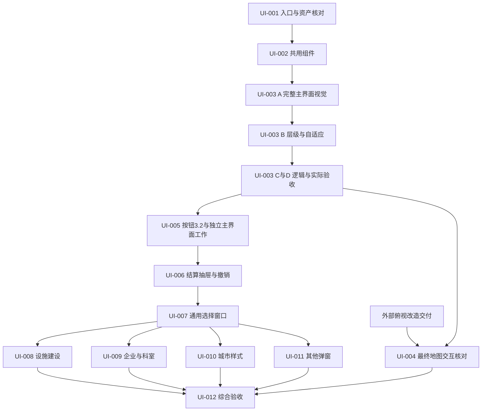

# UI 更新实施计划

更新日期：2026-09-25。状态：UI-001 静态接入基线、UI-002 共用组件、UI-003 主界面框架已交付；新增按钮 3.2 素材已整理，尚未接入 Unity。UI-004 暂缓至其他开发者的俯视改造交付，下一步可先执行 UI-005 的独立界面工作。后续主模块业务及综合对局验收尚未完成。

本计划在现有素材整理结果上新增执行安排，保留原文档。核心目标是接入新版素材、统一对局界面交互，并让不同大小和比例的窗口都能正常操作。

本次新增[单页面与字体补充规范](02-单页面与字体补充规范.md)，落实 UI-001 完成后的用户要求。后续以该规范约束页面切换、effect 页恢复和五种字体使用；[UI-001 原记录](执行记录/2026-09-24_UI-001_接入基线.md)保留其当时的核对结论。

2026-09-25 新增[视觉搭建优先规范](03-视觉搭建优先与分阶段验收.md)：每个界面按“素材依据 → 完整基准视觉 → 层级与适配 → 业务逻辑 → 就绪后实际验收”推进。UI-003 先完成主外框与所有主模块视觉，不能只给旧桌面添加顶底栏后开始整页验收。

同日，在用户确认 UI-003 完成后收到 MainButtons 3.2。新增[按钮增量规范](04-主界面按钮3.2增量规范.md)及 [UI-005 补充提示词](UI-005-补充-主界面按钮3.2.md)。随后用户说明世界地图将由其他人改成俯视，新增[05 任务安排](05-地图俯视改造期间的任务安排.md)：当前顺序为 UI-003 → UI-005，UI-004 待俯视改造后恢复。UI-005 在业务接线前先完成新按钮的视觉与层级，地图端到端部分明确留待补验。

## 1. 已有依据与边界

### 1.1 素材版本

入口为 [整理版 README](../../游城拓荒/UI素材/整理版-2026-09-24/README.md)、[版本关系](../../游城拓荒/UI素材/整理版-2026-09-24/文档/01_版本与替换关系.md)、[资产目录](../../游城拓荒/UI素材/整理版-2026-09-24/资产目录.md) 和 [预览索引](../../游城拓荒/UI素材/整理版-2026-09-24/预览索引.md)。

| 范围 | 采用依据 | 实施注意 |
| --- | --- | --- |
| 主界面、顶栏、底栏、结算抽屉、通用框体及未被专项补丁覆盖的按钮 | `FrontierUI-v3-Patch` 的实际 3.1 组件；布局补丁字段仍写 3.0.0 | 以实际组件索引和包内内容核对，不仅看 ZIP 文件名 |
| 三个右下页签、六个主要行动、撤销与结束行动，共 11 个按钮 | `MainButtons-v3.2-Patch`，优先于上述按钮的 3.1 样式 | 见[增量目录](../../游城拓荒/UI素材/整理增量-2026-09-25-按钮3.2/README.md)；仅按用途覆盖，不全局替换同名共用按钮 |
| 原卡、地图／城市内容、玩家标记和未替换控件 | `MainGameUI-v2.2` 及整理后的沿用资产 | 没有新版替代的内容保留；旧顶栏不重新引入 |
| 企业、设施、城市样式、科室、卡牌和选项窗口 | 各专用包的内容与交互说明，再适配新共用样式 | 新补丁只有新版主界面预览，不能当作已交付全部新版弹窗 |
| 企业窗口版本 | 包名 v1.0，实际 1.0.1 | 记录实际版本；不改原包 |
| 兼容组件 | `turn-tag`、`redzone-paper` 等 | 整理保留不等于主界面必须使用，按实际设计与数据入口选择 |

2026-09-24 整理版有 180 份去重图像、71 份原包 JSON 副本，原目录保留。新增 3.2 独立增量含 51 项逻辑按钮素材、153 份 PNG／SVG 源素材文件及其他说明／预览；不同口径的数量不能直接相加当作运行时资源数。仅导入实际所需资源。原包 `assetCount` 声明与实际组件数的差异已记录，以实际索引为准。

### 1.2 已核对的项目入口

| 入口 | 当前事实 | 对换新的影响 |
| --- | --- | --- |
| [GameplayInteractionHud.prefab](../../Assets/YC/Presentation/Prefabs/Gameplay/GameplayInteractionHud.prefab) | 同时包含屏幕 Canvas 和桌面 WorldSpace Canvas | 常驻栏与内容窗口需明确所属层级，不能随地图缩放 |
| [TabletopCanvasLayout](../../Assets/YC/Presentation/TabletopCanvasLayout.cs) | 桌面层依赖地图边界配置 | 新内容区布局须同步处理视口、地图相机和坐标映射 |
| [SampleScene](../../Assets/Scenes/SampleScene.unity)、[ThreePlayerScene](../../Assets/Scenes/ThreePlayerScene.unity) | 共用 HUD，地图资源不同 | 两个实际场景均要检查；执行前复核发布入口及场景覆盖 |
| [GameplayDialogRegistry](../../Assets/YC/Presentation/GameplayDialogRegistry.cs) | 提供正式弹窗引用和实例化入口 | 窗口换新应落到实际注册与运行路径 |
| [InteractionRequestRouter](../../Assets/YC/Presentation/Workflows/InteractionRequestRouter.cs) | 按玩家可见请求选择 renderer | 复用请求生命周期，不为每个新窗口建立独立规则状态 |
| [基础内容迁移与 UI 接入边界](../../docs/设计/基础内容迁移与UI接入边界.md) | 2026-09-21 记录主要行动仍有旧预选入口，部分扩展规则待定义 | 必须重新核对现状；UI 迁移不能默认所有底层能力已齐全 |

执行时以代码现状复核上述入口。这里的读取结果不代表运行验证。

### 1.3 UI-003 完成后的交接

- [UI-003 交付记录](执行记录/2026-09-25_UI-003_常驻栏与适配框架.md)及[视觉清单](执行记录/2026-09-25_UI-003_视觉清单.md)是后续基线。当前实际画面证据采用 `UI003-LayerFix-*`；原记录保留。本次整理只读取证据，没有重新运行 Unity。
- 主界面框体、顶底栏、统一层级、唯一页面及 effect 恢复已在框架范围交付。旧设施供应／格位仍有过渡 View；UI-005 可先迁移独立 UI 与真实主模块数据，城市格位在实际迁移任务中核对，世界地图精确命中和相关完整行动链待俯视改造后由 UI-004 补验。
- 当前旧行动六格包含使用角色牌／宣告样式，新素材六格包含建设／特殊行动；UI-005 按语义迁移并保留原可用功能，不能按旧按钮序号换图。详见 04。

## 2. 新要求对旧方案的修订

| 原资料中的情况 | 本轮采用要求 |
| --- | --- |
| 旧层级把嵌套选择器／提示放在底栏之上 | 顶栏和底栏在所有对局内容窗口、嵌套选择、提示及拖拽之上，显示和输入同时保证 |
| 旧设计使用固定 1920×1080 矩形或整套等比缩放 | 保留参考构图；实际按安全区域、最小尺寸、伸缩约束和内容重排布局 |
| 部分旧弹窗下缘为 y=1012，新底栏从 y=986 开始 | 不照搬旧弹窗高度；统一约束在顶底栏之间的内容区，重排页脚和滚动区 |
| 旧建设窗口内含独立效果区 | 按新版素材语义迁到全局结算摘要／抽屉，复用同一操作上下文 |
| 现有部分窗口带标题栏拖动手柄 | 游戏内所有窗口不可拖动移位，位置由资产与自适应布局决定；内容滚动、卡牌拖拽和地图平移独立保留 |
| 先前方案允许主窗口、抽屉和子窗口叠加 | 同时最多一张可见页面；独立抽屉、详情和子选择替换当前页，或作为当前页内部区域／步骤 |
| 顶栏收起／展开曾沿用素材的主界面折叠语义 | 针对当前结算 effect 页：收起后查看其他资料，展开时关闭当前资料页并恢复有效 effect 步骤 |
| 字体只按通用中西文方案描述 | 按方正普通文字、汉仪强调文字、msyh 特殊字词、NarrowBold 效果数字、wide 纯 UI 数字分配 |
| 原先 UI-003 先接主框架逻辑，主模块整体迁移安排在 UI-005 | 将完整主界面视觉提前到 UI-003；外框和模块素材齐全后核对层级，再接业务逻辑，UI-005 复用已核对的结构 |

用户本次要求和本分类共同约束是本轮层级与适配的执行依据。旧资料继续作为版本和视觉参考保留。

## 3. 对局层级与输入方案

### 3.1 显示顺序

下表由低到高。实际 sorting 值在 UI-003 中集中配置，不能在每个控制器临时加数。

| 层 | 内容 | 输入边界 |
| --- | --- | --- |
| 1 | 地图、城市板及地图交互标记 | 位于实际视口；UI 命中时不向地图穿透 |
| 2 | 玩家、手牌、资源、合作区、牌堆和行动页签 | 内容区基础交互 |
| 3 | 当前唯一页面及其遮罩，可为 effect 页、独立抽屉、详情、设置或查看器 | 页面互斥；子选择切换步骤或替换当前页，遮罩仅阻挡内容区 |
| 4 | 内容工具提示、拖拽展示及临时提示 | 限于内容区；装饰默认不拦截射线 |
| 5（最高） | **常驻顶栏、常驻底栏及各自内部状态提示** | **独立输入分组；两栏始终可达** |

顶栏与底栏不重叠，无需争夺彼此优先级。栏内提示不得遮住另一项合法操作；大型帮助或详情放回内容窗口层。对局中的结束展示、断线提示、设置弹窗也遵守本约定。

### 3.2 输入规则

- `ContentRect` = 安全区域扣除实际顶栏高度、底栏高度及配置间距后的区域。当前唯一页面、其遮罩及内部结算／选择区域均约束在该区域。
- 内容模态锁定只影响内容分组。最高层 Canvas 根节点不放可命中的整屏透明底板。
- 点击、触摸、滚轮、焦点导航与拖拽捕获分别验证。UI 上的点击不继续触发地图；内容的指针捕获结束后正确释放。
- 结束行动／撤销根据当前会话能力禁用，其他合法功能保持可用。等待网络结果不整体锁死顶底栏。
- 所有能创建临时 Canvas 的窗口、拖拽和提示都使用统一层级策略；禁止通过扫描全部 Canvas 后取 `max + 1` 超过两栏。
- 顶底栏操作与当前页面共用请求版本校验。effect 页可收起并保留有效选择，关闭资料页后继续保持收起；点击顶栏“展开”才恢复当前有效步骤，不能恢复过期提交。
- 顶栏按钮只承担 effect 页收起／恢复。收起不取消、不提交 effect，隐藏页释放输入与遮罩；展开时关闭当前资料页再显示 effect 页。资料入口、子选择及独立抽屉都遵循同时最多一页。
- 所有窗口、弹窗、查看器和抽屉不支持用户拖动移位。标题、背景、边缘不绑定窗口移动；重新打开不恢复历史拖动偏移。允许的卡牌／设施拖拽、滚动和地图／图像平移仅作用于对应内容。

### 3.3 已发现需要审计的入口

| 当前入口 | 已读到的行为 | 必须解决的问题 |
| --- | --- | --- |
| `CardPointerInteraction.ResolveDragSortingOrder` | 扫描 Canvas 排序后取更大值 | 拖拽可能越过常驻栏；改为受限的内容拖拽层 |
| `BuildInfoPanel` | 拖拽展示设置独立排序 | 纳入统一层级，避免临时提高排序 |
| `CityStyleDeclarationPreviewView`、`EventChoiceDialogView` | 有独立 `overrideSorting`／固定排序 | 统一窗口层和遮罩边界 |
| `EffectDialogShellView` | 使用弹窗排序配置 | 主窗口与子窗口均受全局边界约束 |
| `EffectDialogDragHandle`、`EffectDialogShellView` | 标题栏拖动修改窗口位置，View 校验手柄并在运行时设置启用状态 | 停用窗口移动入口及重新启用路径，同步调整必需引用校验，避免初始化后又能拖窗 |
| `InfluenceModelUiCamera` | 相机深度与 Canvas 排序相关 | 同时核对相机合成，不能只检查 Canvas 数字 |
| `MapInteractionRouter`、`TabletopPointerClassifier` | 负责 UI 与地图命中归属 | 布局改变后核对实际 EventSystem、Raycaster 和视口坐标 |

这些是最初审计起点；UI-003 已补充框架范围的层级、输入与恢复证据。后续以其最新记录和当前资产复核，新增入口仍按同一约束验证，不把此表当作全部尚未处理的问题。

### 3.4 单页面与 effect 恢复状态

页面管理分开维护“当前显示页”和“当前 effect 的恢复信息”。典型流程为：effect 页显示 → 收起（保留请求与草稿）→ 主界面打开资料 A → 切换资料 B → 顶栏展开（关闭资料 B，恢复当前有效 effect 页）。任一步可见页面数都不超过 1。

资料页关闭后返回主界面，effect 保持收起。同一请求刷新不得强制弹回；pending 回包、下一步骤、请求失效和流程结束时更新或清除恢复目标。隐藏不是 renderer 的业务清理／取消；隐藏页不得截获 effect 地图选点。具体状态、直接设置入口及抽屉定义见[补充规范](02-单页面与字体补充规范.md)。

## 4. 自适应布局方案

### 4.1 布局骨架

```text
屏幕安全区域
├─ 顶栏：横向伸展，按内容约束高度，始终保留
├─ 内容区：自动扣除顶底栏
│  ├─ 左侧信息区：最小／首选／最大宽度，支持紧凑入口
│  ├─ 中央区域：地图优先使用剩余空间，下方组织玩家与手牌
│  ├─ 右侧操作区：按页签切换，受最小宽度约束
│  └─ 唯一页面容器：显示当前 effect 页或资料页，内部自适应分栏及滚动
└─ 底栏：撤销、结算摘要、结束行动；高度变化通知内容区
```

沿用当前 uGUI／TMP 技术栈。先建立集中可序列化的布局配置，明确基础缩放、栏高范围、侧区宽度范围、间距、紧凑阈值及最大窗口宽度。使用锚点、布局组件和尺寸约束表达关系，避免多个组件互相驱动尺寸产生布局循环。

`CanvasScaler` 的参考尺寸可从设计基准起步，但缩放模式和宽高权重需要实际画面验证。界面可读性不能仅靠缩小整张 1920×1080 画布解决。

游戏内窗口不能拖动。其位置及尺寸由资产配置和布局约束决定；适配时自动重排、居中或停靠在配置区域。本文的“窗口大小变化”指游戏应用窗口／实际渲染区域变化，不能用让玩家手动拖开弹窗来解决遮挡或屏幕空间不足。

### 4.2 模式与内容优先级

| 模式 | 使用条件 | 布局行为 |
| --- | --- | --- |
| 宽屏 | 内容区能容纳全部首选尺寸 | 中央地图增加可用面积；卡牌、文字和弹窗保留合理最大宽度 |
| 标准 | 能容纳各区最小尺寸 | 侧区伸缩，中央取得剩余空间；列表自适应列数／滚动 |
| 紧凑 | 宽或高不足以同时展示全部区域 | 次要面板折叠为可访问入口，分栏改分段／纵排，长内容滚动；保持顶底栏与主要操作 |

条件使用实际可用逻辑宽高及内容最小尺寸，由 UI-001 测量、UI-003 落成配置；此处不把某个分辨率写死为模式开关。宽度够但高度不足同样需要紧凑策略。

- 顶栏保留关键回合／状态和设置入口；次要信息可以简写、折叠或进入详情，完整内容仍可查。
- 顶栏“收起／展开”用于 effect 页恢复；侧区的自适应折叠独立处理，不复用该按钮。
- 底栏优先保留撤销与结束行动的操作位置，结算摘要可收起为打开抽屉的入口。必要时增加栏高并同步缩小内容区，不能挤出屏幕。
- 紧凑模式切换复用同一组状态和控件绑定，避免复制两个可提交的行动入口。
- 长中文、多位数字、长玩家名和空数据纳入布局验证。字体下限与命中尺寸是可编辑配置；可读性用实际显示检查。
- 尺寸变化时保留有效选择、滚动锚点和焦点；重排期间不发业务命令。不要在每帧反复设置整套布局或创建新对象。

### 4.3 原图比例与坐标

| 内容 | 原图比例／尺寸 | 适配要求 |
| --- | --- | --- |
| 设施卡 | 600×850，12:17 | 等比，文字与选择框不被拉伸 |
| 企业卡 | 650×1850，13:37 | 适配长卡，必要时滚动或查看详情 |
| 科室卡 | 516×1000，129:250 | 等比，卡数量变化时重排列数 |
| 城市样式 | 930×600，31:20 | 预览与详情采用完整图像映射 |
| 城市板 | 2059×3801 | 格位使用源内容坐标映射，不把整张图片平均分成 12 格 |

城市格位依据源资料：列起点 100、730、1360，行起点 156、1036、1916、2796，每格 600×850，核心位为第三行第二列。换算必须考虑实际显示矩形、等比留白和父级缩放；这些是源图语义坐标，不是所有屏幕固定 UI 位置。

UI-003 先完成地图／城市实际显示容器、等比原图及必要视口约束，让完整主界面按素材构图呈现。UI-004 再深入校验相机方案与屏幕点到地图点转换，确保拖拽、缩放、平移和边界限制一致。常驻栏不能被桌面相机驱动。

当前 UI-004 的世界地图校验延后到俯视改造完成。上述城市板源图坐标仍是实际城市交互的核对依据，UI-005／008／010 在各自迁移时复用或补足映射，避免把整个世界地图任务设为城市窗口搭建的前置。相机改造需承接 `mapRegion → SetScreenViewport` 接口，具体交接见 05。

### 4.4 字体与混排

UI-002 建立五种语义字体配置：`FangZhengHeiTiJianTi-1` 普通文字，`HanYiCuHeiJian-1` 强调文字（不勾选加粗），`msyh` 特殊字词，`Novecento NarrowBold` 卡面 effect 相关数字，`Novecento wide Normal Regular` 纯 UI 数字。后者用于顶栏回合数；资源 icon 前数字和选择次数使用 NarrowBold。

源文件路径、文件头和字体名称见[字体来源清单](字体来源清单-2026-09-24.json)。宽体字体实际文件为 `.woff2.ttf`，msyh 是 TTC；实际成员提取与字体接入沿用 [UI-002 交付记录](执行记录/2026-09-24_UI-002_共用组件.md)。后续新增按钮、混排和动态条目仍需检查字形与字体刷新路径。

## 5. 分阶段推进与出口

| 阶段 | 任务 | 阶段出口 |
| --- | --- | --- |
| A：核对基线与资源 | 001、002 | 实际资产和入口清单；选定素材正确导入，基础组件可展示；已交付，不等于整页已搭建 |
| B1：完整主界面视觉 | 003-A | 基准尺寸的主外框、全部模块底图／边框／标题／内容、完整顶底栏按素材文档呈现 |
| B2：层级与大小屏布局 | 003-B | 显示顺序、相机、遮罩及命中区正确，基准构图成立后完成自适应 |
| B3：主框架逻辑与验收 | 003-C／D | 新视觉节点接入唯一页面、effect 恢复及常驻栏功能；素材就绪后做实际交互与截图核对 |
| B4：主模块与按钮 | 005（含按钮 3.2 补充） | 承接 003，先完成新版 11 按钮视觉，再接动态数据及独立行动入口；地图相关端到端部分单列待验 |
| B5：最终地图交互 | 004，等待俯视改造交付 | 复用外部改造与城市迁移证据，核对最终地图的视口、点击、导航及相关行动链 |
| C：打通共用操作链 | 006、007 | 摘要／抽屉／撤销能力展示、通用选择、请求生命周期协同可用 |
| D：逐窗口接入 | 008、009、010、011 | 已有业务入口逐一接通；未提供规则的模块明确标记缺口 |
| E：实际验收 | 012 | 多尺寸真实画面、输入、单局与多人验证记录；通过项和未完成项分别列出 |



当前跳过暂缓的 UI-004，先推进 UI-005 及后续独立 UI；俯视改造完成后恢复地图验证。UI-008／010 接正式选择前要有各自城市容器的格位证据，不以整个 UI-004 为硬前置。窗口任务共用框架资产，修改前检查前项输出，避免各自再建一套主题、模态管理器或请求路由。

各实施任务优先形成一个实际入口可运行的完整改动。可用组件若尚未绑定场景，必须标记为组件阶段，不能报告窗口迁移完成。缺少规则接口的模块不阻碍其他界面推进，但属于最终完成状态的显式限制。

后续每个窗口沿用同一顺序：先把当前页按素材完整搭出并消除缺图／遮挡，再接业务。搭建期预览与少量截图属于诊断；正式多尺寸截图前核对必需资源、字体、页面状态和布局就绪，不能只以固定等待帧数放行。

## 6. 屏幕及状态验收矩阵

下表是整轮计划验证范围，尚未全部执行；UI-003 已记录两场景 1920×1080、1280×720、1024×768、2560×1080、900×600 的框架画面。该证据不覆盖尚未接入的 3.2 按钮及全部业务／联机状态。支持下限需综合实际可读性与操作结果确定，窄窗口检查不代表承诺原生移动端发布。

| 等级 | 实际渲染尺寸 | 目的 |
| --- | --- | --- |
| 基础 | 1280×720、1920×1080、2560×1440 | 常见 16:9，检查可读性和缩放 |
| 不同比例 | 1920×1200、1024×768 | 16:10、4:3，检查横向空间减少后的重排 |
| 超宽 | 2560×1080 或 3440×1440 | 地图增加空间，侧区与卡牌不异常拉伸 |
| 压力与下限探索 | 960×540、3840×1080、800×1000 | 小高度、极宽和窄窗口；给出可用性结果及实际支持下限 |
| 系统缩放 | 可用设备上的 100%、125%、150%、200% | 记录实际渲染尺寸和 DPI，不能只记录桌面分辨率 |

至少在基础最小尺寸、基准尺寸、4:3、超宽与窄窗口，检查下列状态；其他尺寸可先做主框架检查，发现问题后针对性扩大。

1. 正常对局、长文本和多位资源数、非当前玩家视角。
2. effect 页收起 → 查看资料 A → 切换资料 B → 展开恢复 effect；子选择与独立抽屉也通过唯一页面切换。全过程最多一页，两栏合法功能可操作。
3. 卡牌拖拽、建设位置预览、地图平移／缩放；确认常驻栏与 UI 命中优先级。
4. 0／1／标准／超量候选，滚动末项、选中态、取消、返回和确认。
5. pending、提交拒绝、旧请求失效、断线重连；无重复提交或隐藏信息泄漏。
6. 在弹窗、选择或拖拽中改变窗口大小，再次检查焦点、点击坐标、选择与报价。
7. 打开设置、规则书、日志、图片查看器和对局结束展示，常驻栏仍可访问。
8. 固定渲染尺寸下，尝试拖动各窗口的标题、背景和边缘，窗口位置不变；内容滚动、合法卡牌拖拽和地图／图像平移仍正常。关闭重开、切换请求后也不能重新启用拖窗。
9. 五种字体角色、汉仪关闭 Bold、数字与中文字词混排、特殊词“策略／计谋”实际显示；运行中字体恢复和动态条目创建不覆盖角色。
10. effect 页收起后同一请求刷新、pending 回包、进入下一步骤或失效；不自动弹回、不误提交，展开只恢复当前有效步骤。

## 7. 交付与完成标准

- 源素材到 Unity 资产、Prefab、Registry、实际场景入口可追溯；新旧引用和场景覆盖状态有记录。
- 原有可用功能沿正式入口继续工作，没有重复行动入口、争用输入的旧控制器或演示假数据。
- 常驻栏显示与输入优先级均成立；弹窗遮罩不拦截两栏，命令禁用原因来自当前业务。
- 同时最多一张可见页面，effect 收起与展开保留有效上下文且不改变规则进度；展开时关闭当前资料页。
- 五类文字与数字按用户指定字体显示，汉仪不额外勾选 Bold，混排及字体恢复经实际检查。
- 游戏内所有窗口不可拖动移位，布局决定其位置；内部滚动与其他合法内容交互不受影响。
- 目标屏幕范围可读、可操作，窗口动态调整后状态一致；界面没有依靠裁剪关键内容完成适配。
- 行为测试与真实场景画面均有证据。优先复用 `tools/tests` 下相关验证入口，运行前确认不会重建资产。
- 每项写新的执行记录，保存实际截图的尺寸、场景、操作步骤及对应资产来源。总结区分资源整理、组件搭建、正式接入、规则缺口和验收完成状态。

当前 UI-001／002／003 已按各自范围交付。下一步将 [UI-005](UI-005-主界面模块与行动入口迁移.md) 与[按钮 3.2 补充](UI-005-补充-主界面按钮3.2.md)共同执行；[UI-004](UI-004-地图视口与城市坐标适配.md)按 05 暂缓至俯视改造交付。相关地图验收保留为待办，最终补齐后再标记对应流程完成。本轮仅调整文档，未修改 Unity 资产或执行地图测试。
