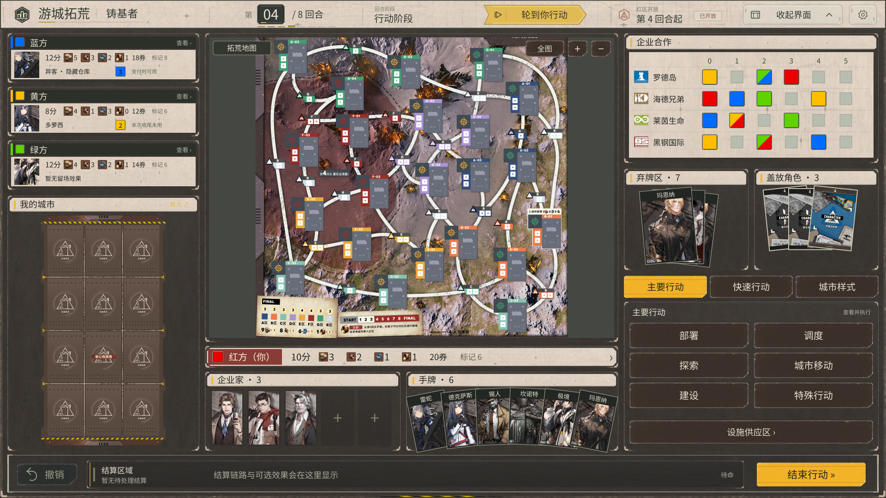
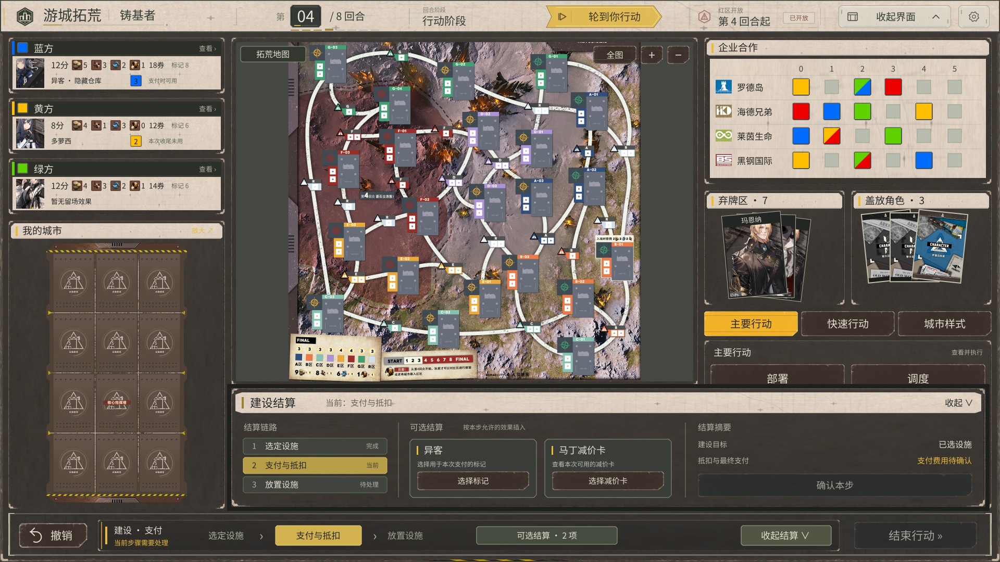

# UI 预览索引 · 2026-09-24

本目录的 PNG 均为源包原样副本。Frontier 主界面与各专用窗口的静态拼装由源包提供；选项窗口的两张图是视觉样例，精确位置以配置和原说明为准。它们均不是本次 Unity 运行截图。

当前采用关系是主界面内容基线 2.2 + Frontier 组件及顶栏 3.1。其他窗口还保留历史主题，需要按新版映射适配，不能将下方历史预览当成已完成新版换肤的证明。

[返回整理入口](README.md) · [版本与替换关系](文档/01_版本与替换关系.md)

## 当前新版主界面

## 当前新版主界面 · 3.1

| 预览 | 图片尺寸 |
|---|---:|
| [拆件总览](预览/FrontierUI-v3-Patch/component-sheet.png) | 1600 × 1100 |
| [城市样式页](预览/FrontierUI-v3-Patch/main-city-patterns.png) | 1920 × 1080 |
| [侧栏收起](预览/FrontierUI-v3-Patch/main-collapsed.png) | 1920 × 1080 |
| [空闲主界面](预览/FrontierUI-v3-Patch/main-idle.png) | 1920 × 1080 |
| [结算摘要收起](预览/FrontierUI-v3-Patch/main-resolution-compact.png) | 1920 × 1080 |
| [展开结算抽屉](预览/FrontierUI-v3-Patch/main-resolution.png) | 1920 × 1080 |
| [顶栏细节](预览/FrontierUI-v3-Patch/topbar-detail.png) | 1920 × 328 |

## 历史主界面 · 2.2，供版本对照

| 预览 | 图片尺寸 |
|---|---:|
| [拆件总览](预览/MainGameUI-v2.2/component-sheet.png) | 1600 × 1100 |
| [主要行动页](预览/MainGameUI-v2.2/main-actions.png) | 1920 × 1080 |
| [城市样式页](预览/MainGameUI-v2.2/main-city-patterns.png) | 1920 × 1080 |
| [顶栏细节](预览/MainGameUI-v2.2/topbar-detail.png) | 1600 × 460 |

## 企业与特效窗口 · 1.0.1，历史主题

| 预览 | 图片尺寸 |
|---|---:|
| [选择企业](预览/EnterprisePicker-v1.0/company-choice.png) | 1920 × 1080 |
| [选择企业特效](预览/EnterprisePicker-v1.0/effect-choice.png) | 1920 × 1080 |

## 设施建设窗口 · 1.0.0，历史主题

| 预览 | 图片尺寸 |
|---|---:|
| [独立延伸枢纽选择](预览/FacilityBuild-UI-v1.0/extension-three.png) | 1920 × 1080 |
| [多候选设施](预览/FacilityBuild-UI-v1.0/many-candidates.png) | 1920 × 1080 |
| [常规设施建设](预览/FacilityBuild-UI-v1.0/standard.png) | 1920 × 1080 |

## 城市样式详情与宣告 · 1.0.0，历史主题

| 预览 | 图片尺寸 |
|---|---:|
| [宣告城市样式](预览/CityPattern-UI-v1.0/declaration.png) | 1920 × 1080 |
| [城市样式详情](预览/CityPattern-UI-v1.0/details.png) | 1920 × 1080 |

## 公共科室选择 · 1.0.0，历史主题

| 预览 | 图片尺寸 |
|---|---:|
| [多候选科室](预览/RhineDepartment-UI-v1.0/many.png) | 1920 × 1080 |
| [三候选科室](预览/RhineDepartment-UI-v1.0/three.png) | 1920 × 1080 |
| [两候选科室](预览/RhineDepartment-UI-v1.0/two.png) | 1920 × 1080 |

## 选项窗口 · v1，视觉样例

| 预览 | 图片尺寸 |
|---|---:|
| [重复出售视觉样例](预览/Option-Picker-UI-v1/repeat-options.png) | 1672 × 941 |
| [单选视觉样例](预览/Option-Picker-UI-v1/single-options.png) | 1672 × 941 |

## 通用卡牌选择

Card-Picker 包提供 `PREVIEW.html`，没有独立的完整静态窗口预览 PNG。本次保留切图、参数与校准样本；需要交互预览时，将 [原 ZIP](../Card-Picker-UI-v1.zip) 解压到独立目录，打开包内 `PREVIEW.html`。

所有原包 HTML 均保存在对应 ZIP 中。本次未执行其中的构建脚本，也未运行浏览器交互验证。
